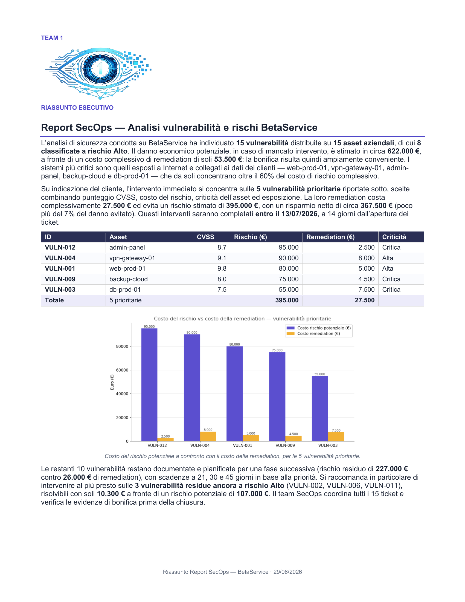
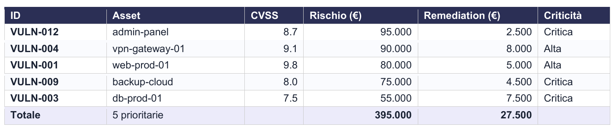
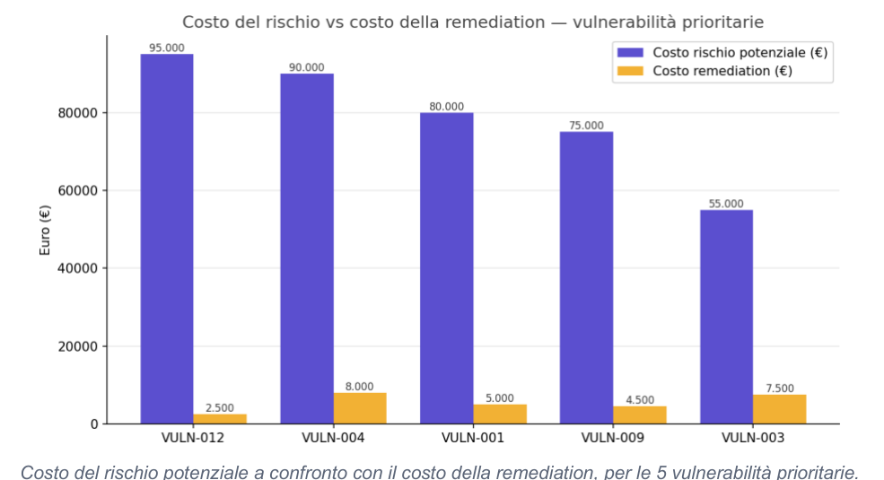

# Report SecOps — Analisi vulnerabilità e rischi BetaService

<p align="center">
  
</p>

## Riassunto

Questo repository contiene un **riassunto esecutivo del Report SecOps BetaService**, realizzato dal **Team 1** e datato **29/06/2026**.

L'analisi di sicurezza condotta su BetaService ha individuato **15 vulnerabilità** distribuite su **15 asset aziendali**. Di queste, **8 sono classificate a rischio alto**. Il danno economico potenziale, in caso di mancato intervento, è stimato in circa **622.000 €**, mentre il costo complessivo degli interventi di remediation è pari a **53.500 €**.

Il confronto tra rischio economico e costo di bonifica mostra che l'intervento è fortemente conveniente: la remediation costa una frazione ridotta rispetto al danno potenziale evitato.

<p align="center">
  
</p>

---

## Indicatori principali

| Indicatore | Valore |
|---|---:|
| Vulnerabilità totali | 15 |
| Asset coinvolti | 15 |
| Vulnerabilità a rischio alto | 8 |
| Esposizione economica potenziale | 622.000 € |
| Costo totale remediation | 53.500 € |
| Vulnerabilità prioritarie | 5 |
| Rischio sulle 5 prioritarie | 395.000 € |
| Costo remediation sulle 5 prioritarie | 27.500 € |
| Risparmio netto stimato | 367.500 € |
| Scadenza interventi prioritari | 13/07/2026 |

---

## Vulnerabilità prioritarie

L'intervento immediato si concentra sulle **5 vulnerabilità prioritarie**, selezionate combinando:

- punteggio **CVSS**;
- costo potenziale del rischio;
- criticità dell'asset;
- esposizione del sistema;
- indicazione del cliente.

| ID | Asset | CVSS | Rischio (€) | Remediation (€) | Criticità |
|---|---|---:|---:|---:|---|
| VULN-012 | admin-panel | 8.7 | 95.000 | 2.500 | Critica |
| VULN-004 | vpn-gateway-01 | 9.1 | 90.000 | 8.000 | Alta |
| VULN-001 | web-prod-01 | 9.8 | 80.000 | 5.000 | Alta |
| VULN-009 | backup-cloud | 8.0 | 75.000 | 4.500 | Critica |
| VULN-003 | db-prod-01 | 7.5 | 55.000 | 7.500 | Critica |
| **Totale** | **5 prioritarie** |  | **395.000** | **27.500** |  |

<p align="center">
  
</p>

---

## Analisi economica

Il report mette a confronto il **costo del rischio potenziale** con il **costo della remediation** per le vulnerabilità prioritarie.

La differenza è significativa: con un investimento di **27.500 €**, BetaService può ridurre un rischio stimato di **395.000 €**. Il risparmio netto stimato è quindi di circa **367.500 €**.

<p align="center">
  
</p>

---

## Asset più critici

I sistemi più critici sono quelli esposti a Internet o collegati ai dati dei clienti:

- `web-prod-01`;
- `vpn-gateway-01`;
- `admin-panel`;
- `backup-cloud`;
- `db-prod-01`.

Questi asset concentrano oltre il **60% del costo di rischio complessivo**.

---

## Piano di remediation

Gli interventi sulle 5 vulnerabilità prioritarie devono essere completati entro il **13/07/2026**, cioè entro 14 giorni dall'apertura dei ticket.

Le attività previste includono:

- apertura e aggiornamento dei ticket;
- assegnazione ai team responsabili;
- remediation tecnica;
- raccolta delle evidenze;
- verifica finale da parte del team SecOps;
- chiusura controllata dei ticket.

---

## Vulnerabilità residue

Le restanti **10 vulnerabilità** restano documentate e pianificate per una fase successiva.

Il rischio residuo stimato è pari a **227.000 €**, con un costo di remediation di **26.000 €**.

Tra queste, le vulnerabilità residue più rilevanti sono:

- `VULN-002`;
- `VULN-006`;
- `VULN-011`.

Queste 3 vulnerabilità sono ancora classificate a rischio alto e risultano risolvibili con **10.300 €**, a fronte di un rischio potenziale di **107.000 €**.

---

## Ruolo del team SecOps

Il team SecOps coordina tutti i **15 ticket** e verifica che ogni attività di bonifica sia supportata da evidenze adeguate prima della chiusura.

Le evidenze possono includere:

- report di nuova scansione;
- screenshot di configurazione;
- log di verifica;
- change request;
- approvazione del responsabile tecnico;
- conferma del rischio residuo.

---

## Struttura del repository

```text
.
├── README.md
└── assets/
    ├── team1-logo.png
    ├── summary-page.png
    ├── priority-table.png
    └── risk-vs-remediation-chart.png
```

---

## Autori

**Team 1**

---

## Note

Questo README è stato creato a partire dal riassunto esecutivo del Report SecOps BetaService. I dati sono presentati a scopo didattico per esercitazioni su cybersecurity, vulnerability management, analisi del rischio e technical reporting.
